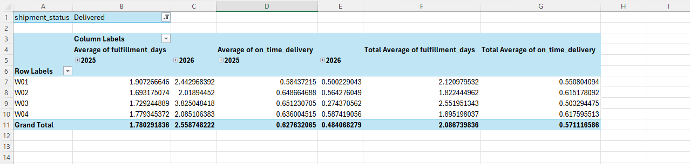
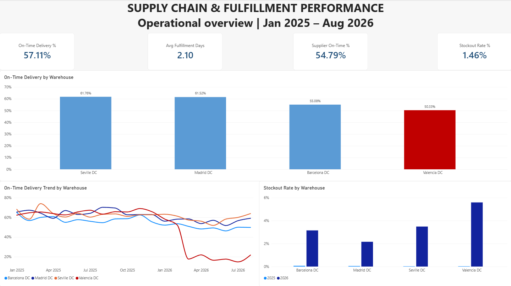
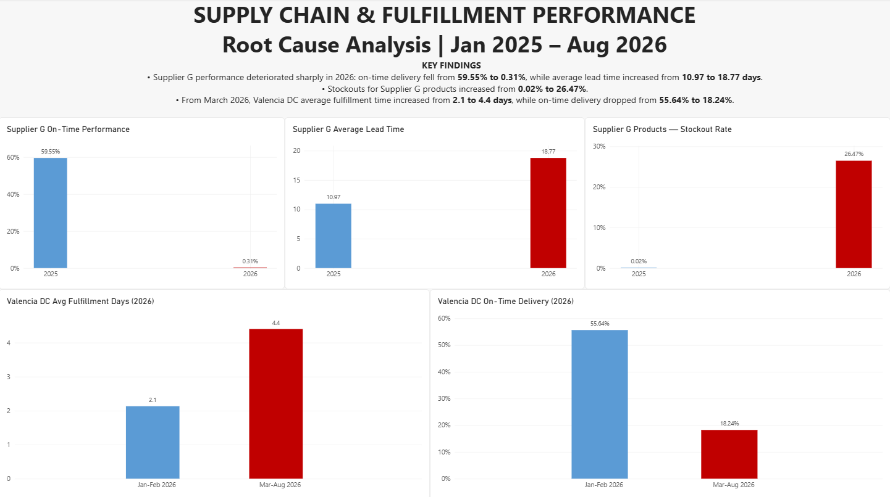

# Supply Chain & Fulfillment Performance Analysis

## Executive Summary

This end-to-end Supply Chain Analytics project investigates where operational efficiency is being lost across supplier performance, inventory availability, fulfillment, and delivery service.

The analysis identified two clear areas of deterioration in 2026. Supplier G's on-time performance fell from **59.55% to 0.31%**, while its average lead time increased from **10.97 to 18.77 days**. At the same time, stockouts across Supplier G products increased from **0.02% to 26.47%**.

A second operational break appeared at Valencia DC from March 2026. Average fulfillment time increased from **2.1 to 4.4 days**, while on-time delivery declined from **55.64% to 18.24%**.

The evidence suggests that management should prioritize investigation of Supplier G's inbound reliability and Valencia DC's fulfillment process, while monitoring inventory availability as a connected operational risk.

---

## Business Problem

A distribution company is experiencing operational problems including delivery delays, stockouts, and significant differences in performance between suppliers and distribution centers.

Operations Management wants to understand:

> **Where is the supply chain losing operational efficiency, and which suppliers, products, or fulfillment operations should management investigate first?**

The analysis focuses on the operational chain:

**Supplier → Inventory → Fulfillment → Delivery**

**Analysis period:** January 2025 – August 2026

---

## Dataset

The project uses a synthetic relational supply chain dataset containing:

- 18 suppliers
- 220 products
- 4 distribution centers
- 6,200 purchase orders
- 18,000 customer orders
- 45,007 order items
- 18,000 shipments
- 535,160 raw daily inventory snapshots

The initial data-quality assessment also identified:

- 120 duplicate inventory snapshots
- 2 suppliers with missing country information
- 1 warehouse with missing capacity information
- 17,858 delivered shipments
- 142 shipments still in transit

---

## Methodology

### 1. Data Quality & Preparation

PostgreSQL was used to inspect table grain, validate row counts, identify missing values, check shipment status, and detect duplicate inventory snapshots.

Duplicate inventory records were removed using `ROW_NUMBER()`, while missing supplier country values were standardized as `Unknown`.

Shipments still in transit were excluded from completed delivery performance calculations.

### 2. Supplier Performance

Purchase order data was used to measure:

- Actual supplier lead time
- Supplier delivery delays
- Supplier on-time performance
- Quantity received in full

Supplier performance was then compared across periods to identify deterioration.

### 3. Inventory Availability

Daily inventory snapshots were connected to product and supplier information.

A stockout was defined as:

> **Available Quantity = 0**

This allowed inventory availability problems to be analyzed by warehouse, supplier, product, and year.

### 4. Fulfillment & Delivery

Customer orders and shipments were used to measure:

- Fulfillment time
- Transit time
- Total delivery time
- On-time delivery

Warehouse performance and monthly trends were compared to identify operational changes over time.

### 5. Root Cause Investigation

The investigation then focused on the strongest anomalies identified in the operational overview:

- Supplier G performance deterioration
- Stockouts affecting Supplier G products
- Valencia DC fulfillment deterioration from March 2026

---

## Key Findings

### 1. Overall delivery reliability is weak

Across completed shipments, only **57.11%** were delivered on time.

Average fulfillment time was **2.10 days**, indicating that a substantial part of the service-level problem required investigation beyond the company-wide average.

### 2. Valencia DC shows the weakest overall delivery performance

On-time delivery by distribution center:

- Seville DC: **61.76%**
- Madrid DC: **61.52%**
- Barcelona DC: **55.08%**
- Valencia DC: **50.33%**

The time trend revealed that Valencia's performance deteriorated particularly sharply during 2026.

### 3. Supplier G deteriorated sharply in 2026

Supplier G's on-time performance fell from:

**59.55% → 0.31%**

At the same time, average lead time increased from:

**10.97 → 18.77 days**

This represents the clearest upstream supplier deterioration identified in the analysis.

### 4. Stockouts increased sharply across Supplier G products

The stockout rate for products supplied by Supplier G increased from:

**0.02% in 2025 → 26.47% in 2026**

The timing of this deterioration coincides with the decline in Supplier G's inbound reliability, making this supplier-product group a priority area for further investigation.

### 5. Valencia DC experienced an operational break from March 2026

At Valencia DC:

**Average Fulfillment Time**

2.1 days → **4.4 days**

**On-Time Delivery**

55.64% → **18.24%**

The change beginning in March 2026 suggests an additional fulfillment issue at the distribution-center level rather than only an upstream supplier problem.

---

## Business Recommendations

1. **Prioritize investigation of Supplier G's inbound reliability.** Review lead-time deterioration, delivery consistency, and supplier service-level performance before making structural sourcing decisions.

2. **Review inventory policies for Supplier G products.** The increase in stockouts justifies investigating reorder points, safety stock levels, replenishment timing, and potential contingency supply options.

3. **Investigate Valencia DC operations from March 2026 onward.** Review changes in handling processes, workload, staffing, capacity constraints, or other operational factors that could explain the increase in fulfillment time.

4. **Monitor operational KPIs together.** Supplier reliability, inventory availability, fulfillment time, and on-time delivery should be monitored as connected stages of the supply chain rather than isolated metrics.

---

## Limitations

- The dataset is synthetic and designed for analytical practice.
- The analysis identifies associations and operational patterns, not causal relationships.
- Supplier contract terms, SLA penalties, procurement costs, and alternative supplier capacity are not available.
- Detailed warehouse labor and capacity-utilization data are not available.
- Transport cost and demand forecast accuracy are not included.
- One warehouse has missing capacity information.
- 142 in-transit shipments were excluded from completed delivery performance.
- Stockouts are measured using daily available inventory snapshots.

---

## Next Steps

Further analysis could incorporate:

- Supplier SLA and procurement cost data
- Product-level demand and replenishment patterns
- Safety-stock optimization
- Warehouse labor and capacity utilization
- Carrier performance
- Operational KPI targets and exception alerts

---

## Excel Validation

Excel was used as an independent validation layer between the SQL analysis and Power BI reporting.

A PivotTable was used to reconcile fulfillment and delivery KPIs by warehouse and year. The validation confirmed the overall deterioration in 2026:

- Average fulfillment time increased from **1.78 days in 2025 to 2.56 days in 2026**.
- On-time delivery declined from **62.76% to 48.41%**.
- W03 (Valencia DC) showed the strongest deterioration, supporting the subsequent root-cause investigation in Power BI.

---

## Dashboard

### Operational Overview

### Root Cause Analysis

---

## Tools & Skills

### PostgreSQL
Data validation, joins, aggregations, conditional logic, window functions, analytical views, supplier performance analysis, inventory analysis, and operational KPI development.

### Excel / Power Query
Data validation, KPI reconciliation, PivotTables, and cross-tool result validation.

### Power BI
Data modeling, DAX measures, KPI development, time-based analysis, supplier and warehouse comparisons, root-cause investigation, and dashboard design.

---

## Repository Files

- `01_data_quality.sql` — Data-quality audit
- `02_analytics_layer.sql` — Clean analytical views and operational metrics
- `03_supply_chain_analysis.sql` — Business analysis and root-cause queries
- `Supply_Chain_Fulfillment_Performance_Analysis.pbix` — Power BI report
- `executive_overview.png` — Operational overview dashboard
- `root_cause_analysis.png` — Root cause analysis dashboard
